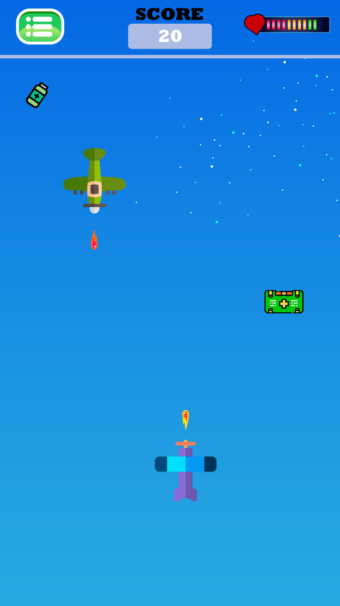
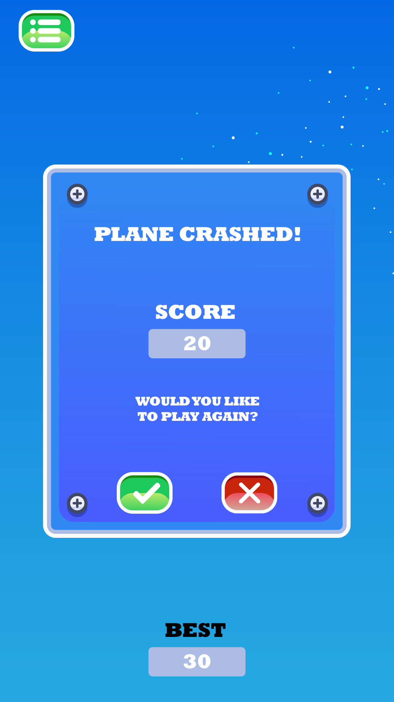
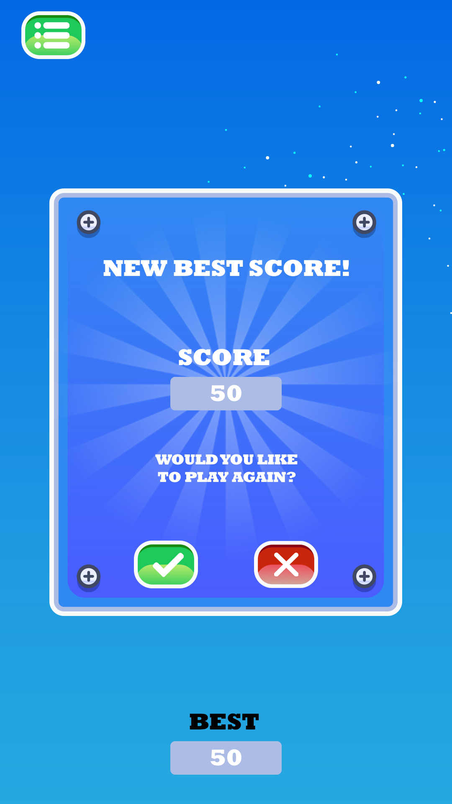

# Тестовое задание
Данная игра разработана в качестве тестового задания на вакансию Junior Android Developer.

## Описание
Игра нацелена на устранению вражеских самолетов путем выстрела и получение очков. В процессе игры 
с некоторым шансом могут появляться аптечки (маленькая и большая), которые помогут восстановить 
здоровье. За каждый сбитый самолет +10 очков. Здоровье состоит из 12 очков. За каждое попадание врага снимается 1.

## Используемый стек
* Hilt
* Coroutines
* Navigation component
* Jetpack compose

## Flow приложения
Точка старта приложение - открывается меню c предложением начать игру

При нажатии на GO начинается игра

При потери всего количества здоровья открывается меню с задним фоном в зависимости от результата

